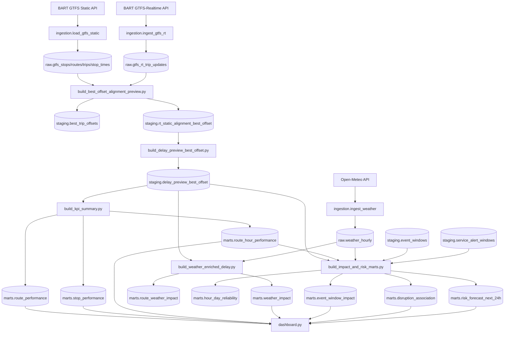

# Architecture

## Design notes

- Storage engine: local DuckDB (`data/transit_delay.duckdb`)
- Modeling pattern: raw → staging → marts
- Critical logic: per-trip best-offset alignment to match RT trip tails to static stop sequences
- Consumer: Streamlit dashboard (4 pages)
